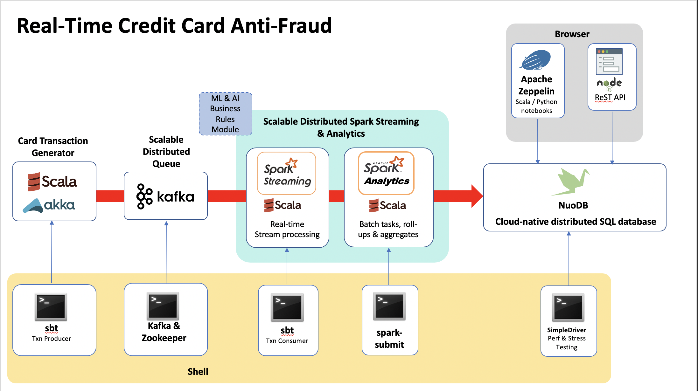

# NuoDB Streaming Data Pipeline Example

How to use modern, real-time, distributed SQL and streaming technologies to build the foudnation for a scalable data pipeline. 
This demo will use these technologies:

- NuoDB
- Spark
- Scala
- Akka


<p>
<p align="center">
  
</p>


## Step 1: Install Pre-Requisites
  - A NuoDB 4.x database to run your queries against.
    - Hardware and software requirements for NuoDB are listed here - http://doc.nuodb.com/Latest/Content/System-Requirements.htm
    - Installation and Deployment options are described here - http://doc.nuodb.com/Latest/Content/Deployment-models.htm
    - You can download the NuoDB Community Edition binaries for various platforms here - https://www.nuodb.com/dev-center/community-edition-download
  - A machine on which to install Kafka, Spark and Zeppelin
    - This could be one of the NuoDB Transaction Engines (TE's), or a separate machine/cloud instance, or even a laptop
    - Ideally these services should be in close proximity to the data source in order to reduce latency

This demo uses an installation running on AWS


## Step 2: Clone the NCFP repository

The first step is to clone this repo to a directory on the machine where you have previously installed NuoDB in Step 1:
```
$ git clone https://github.com/simonambridge/NCFP
```


## Step 3: Create The Data Model

To create this schema and the tables described below, run the create schema script:
```
nuosql <db-name> --user <username> --password <password>
```

For example:
To create the application schema run the create schema script:
```
nuosql hockey --user dba --password dba
```

Next, run the schema creation script itself:
```
SQL> @creates_and_inserts.sql
```

This creates the following tables:

- transactions           - the main transactions table
- hourlyaggregates_bycc  - hourly roll-up of transactions by credit card
- dailyaggregates_bycc   - daily roll-up of transactions by credit card
- monthlyaggregates_bycc - monthly roll-up of transactions by credit card
- yearlyaggregates_bycc  - yearly roll-up of transactions by credit card
- dailytxns_bymerchant   - daily roll-up of transactions by merchant
- txn_count_min          - track transactions in a rolling window for analytics

The create script also creates some sample data for example:

```
INSERT INTO transactions (year, month, day, hour, min, txn_time, cc_no, amount, cc_provider, location, merchant, notes, status, txn_id, user_id, tag)
VALUES ( 2016, 03, 17, 21, 04, '2016-03-17 21:04:19', '1234123412341234', 200.0, 'VISA','San Francisco', 'Nordstrom', 'asked for discounts', 'Approved', '763629', 'tomdavis', 'Fraudulent');
```

## Simple queries

We can now run SQL queries to look up all transactions for a given credit card (`cc_no`). 
The Transactions table is primarily write-oriented - it's the destination table for the streamed transactions and used for searches and we don't update the transactions once they have been written.

The table has a primary key so a typical query would look like this:
```
SQL> SELECT * FROM transactions WHERE cc_no='1234123412341234' and year=2016 and month=3 and day=9;

 TXN_ID       CC_NO       YEAR  MONTH  DAY       TXN_TIME       AMOUNT  CC_PROVIDER  COUNTRY  DATE_TEXT  HOUR  LOCATION  MERCHANT  MIN         NOTES          STATUS     TAG     USER_ID
 ------- ---------------- ----- ------ ---- ------------------- ------- ------------ -------- ---------- ----- --------- --------- ---- -------------------- -------- ---------- --------

 098765  1234123412341234 2016    3     9   2016-03-09 11:04:19   200       VISA      <null>    <null>    11    London   Ted Baker  4   pretty good clothing Approved Suspicious tomdavis
```
The roll-up tables can also be queried - for example transactions for each merchant by day use the dailytxns_bymerchant table.

The roll-up tables are empty at this point - they get populated using the Spark batch and streaming analytics jobs that we run later.


## Searching with SQL

Structured Query Language (SQL) allows you to search for data in the database tables that were created above.

For example, get all transactions for a specified card number.
```
 SQL> select txn_id, cc_no, merchant,amount from transactions WHERE cc_no='1234123412341234' order by txn_id;

                TXN_ID                     CC_NO       MERCHANT  AMOUNT
 ------------------------------------ ---------------- --------- -------

 62d1be5d-15f3-4d04-88ad-a937a3b49e95 1234123412341234 Ted Baker   200
 ```

Get transactions by first 6 digits of cc_no and status.
```
SQL> SELECT * FROM transactions where cc_no like '123412%' and status='Rejected';

 TXN_ID       CC_NO       YEAR  MONTH  DAY       TXN_TIME       AMOUNT  CC_PROVIDER  COUNTRY  DATE_TEXT  HOUR    LOCATION    MERCHANT  MIN         NOTES         STATUS     TAG     USER_ID
 ------- ---------------- ----- ------ ---- ------------------- ------- ------------ -------- ---------- ----- ------------- --------- ---- ------------------- -------- ---------- --------

 763629  1234123412341234 2016    3     17  2016-03-17 21:04:19   200       VISA      <null>    <null>    21   San Francisco Nordstrom  4   asked for discounts Rejected Fraudulent tomdavis
```

When we start generating some live data we'll be able to analyse up-to-date information.


## Step 4: Analyzing data using NuoDB Spark Analytics

NuoDB provides integration with Spark via the NuoDB JDBC driver to enable real-time analysis of data.


### Streaming Analytics

The streaming analytics element of this application is made up of two parts:

* A transaction "producer" - a Scala/Akka app that generates random credit card transactions and then places those transactions onto a Kafka queue. 
* A transaction "consumer" - also written in Scala, is a Spark streaming job that 
(a) consumes the messages put on the Kafka queue, and then 
(b) parses those messages, evalutes the transaction status and then writes them to the NuoDB table `transactions`. 

It also generates rolling summary lines into the `txn_count_min` table every minute.

Streaming analytics code can be found under the directory `TransactionHandlers/producer` (pre-requisite: make sure you have run the SQL schema create script as described above to create the necessary tables).

Follow the Kafka, Spark streaming and SBT installation and set up instructions here: https://github.com/simonambridge/NCFP/blob/master/TransactionHandlers/NCFP-Txn-Handlers-README.md


### Build the packages

At this point you should have NuoDB, Kafka,  Spark and SBT installed. configured and running.

* You should have already created the NuoDB tables using the creates_and_inserts.cql script
* All components should be working e.g. Zookeeper, Kafka

> If you are restarting the demo you can clear the tables using the clear_tables.cql script

1. Navigate to the project TransactionHandlers directory:

    ```
    $ cd <path>/NuoDB-Card-Fraud-Prevention/TransactionHandlers
    ```
    
    Update sbt (may take a little while):

    ```
    $ sbt update
    [info] Done updating.
    [success] Total time: 8 s, completed 20-Dec-2019 01:19:04
    ```
    
    
    Clean up the build environment:

 ```
$ sbt clean
[info] Loading project definition from /home/ec2-user/NuoDB-Card-Fraud-Prevention/TransactionHandlers/project
[info] Loading settings from build.sbt ...
[info] Set current project to transactionhandlers (in build file:/home/ec2-user/NuoDB-Card-Fraud-Prevention/TransactionHandlers/)
[success] Total time: 0 s, completed 20-Jan-2020 21:26:06
 ```

2. Build the Producer app with this command:
  
    ```$ sbt producer/package```
    
    Make sure the build is successful:
    ```
    [info] Done packaging.
    [success] Total time: 5 s, completed 30-Dec-2019 15:31:16
    ```

    > If there are any errors reported, you must resolve them before continuing.


3. Build the Consumer app with this command:
  
    ```
    $ sbt consumer/package
    ```
    
    Make sure the build is successful:
    ```
    [info] Done packaging.
    [success] Total time: 14 s, completed 30-Dec-2019 15:34:42
    ```
    > If there are any errors reported, you must resolve them before continuing.
    

## 5. Run the demo

  At this point the code has compiled successfully.

  The next step is to start the producer and consumer to start generating and receiving transactions.


### Start the Transaction Producer app

From the root directory of the project (`<NCFP install path>/NCFP/TransactionHandlers`) start the producer app:
  
Navigate to the TransactionHandlers directory
```
$ cd /<NCFP install path>/NCFP/TransactionHandlers
```

Start the producer app:
```
$ sbt producer/run
```

After some initial output you will see card transactions being created and posted to Kafka:
```
kafkaHost 127.0.0.1:9092
kafkaTopic NewTransactions
maxNumTransPerWait 5
waitMillis 500
runDurationSeconds -1
[DEBUG] [01/20/2020 21:15:31.737] [run-main-0] [EventStream(akka://TransactionProducer)] logger log1-Logging$DefaultLogger started
[DEBUG] [01/20/2020 21:15:31.738] [run-main-0] [EventStream(akka://TransactionProducer)] Default Loggers started
2 Transactions created.
(cc_no=,1004000087276326, txn_time=,2020-01-20 21:15:31.894, items=,Item_84504->627.04,Item_52160->289.01, amount=,916.05)
(cc_no=,6997000002220440, txn_time=,2020-01-20 21:15:31.921, items=,Item_33526->307.41,Item_92629->654.06, amount=,961.46)
SLF4J: Failed to load class "org.slf4j.impl.StaticLoggerBinder".
SLF4J: Defaulting to no-operation (NOP) logger implementation
SLF4J: See http://www.slf4j.org/codes.html#StaticLoggerBinder for further details.
3 Transactions created.
(cc_no=,7892000058641377, txn_time=,2020-01-20 21:15:32.672, items=,Item_99662->331.93,Item_25323->503.12, amount=,835.04)
4 Transactions created.
(cc_no=,0983000074313343, txn_time=,2020-01-20 21:15:32.866, items=,Item_56422->409.64,Item_83718->270.11, amount=,679.75)
9 Transactions created.
(cc_no=,3580000028152903, txn_time=,2020-01-20 21:15:33.366, items=,Item_11331->525.67,Item_69284->461.34, amount=,987.01)
(cc_no=,0317000033050234, txn_time=,2020-01-20 21:15:33.368, items=,Item_33928->980.74,Item_84843->622.12,Item_35138->147.29,Item_8403->868.42, amount=,2618.57)
(cc_no=,6759000070941524, txn_time=,2020-01-20 21:15:33.369, items=,Item_22633->707.37,Item_36292->172.56,Item_93730->620.76,Item_68802->363.97, amount=,1864.67)
(cc_no=,1544000004428021, txn_time=,2020-01-20 21:15:33.37, items=,Item_67668->236.24,Item_93556->325.77,Item_94628->547.71, amount=,1109.72)
(cc_no=,9768000066399852, txn_time=,2020-01-20 21:15:33.372, items=,Item_63199->855.43, amount=,855.43)
14 Transactions created.
(cc_no=,8301000091470542, txn_time=,2020-01-20 21:15:33.867, items=,Item_86836->392.50, amount=,392.50)
(cc_no=,6109000041496035, txn_time=,2020-01-20 21:15:33.867, items=,Item_51891->635.31,Item_74233->607.48,Item_20548->36.43, amount=,1279.22)
(cc_no=,3634000010746158, txn_time=,2020-01-20 21:15:33.868, items=,Item_63266->720.26,Item_82703->910.15,Item_83318->209.00,Item_79596->241.54, amount=,2080.95)
(cc_no=,8554000034050944, txn_time=,2020-01-20 21:15:33.87, items=,Item_85404->169.94,Item_84596->368.18,Item_9159->699.59, amount=,1237.71)
(cc_no=,8039000079660074, txn_time=,2020-01-20 21:15:33.872, items=,Item_34616->83.95,Item_76718->478.09,Item_31061->763.11,Item_92097->194.94, amount=,1520.09)
15 Transactions created.
```

Leave this job running to continue to generate transactions.

The records for each transaction are consumed and stored in a NuoDB table.
You can view the records that are being created. Start NuoSQL and run the following query:
```
$ nuosql hockey --user dba --password dba

SQL> select * from transactions;

                TXN_ID                     CC_NO       YEAR  MONTH  DAY         TXN_TIME         AMOUNT  CC_PROVIDER  COUNTRY  DATE_TEXT  HOUR    LOCATION       MERCHANT     MIN            NOTES             STATUS     TAG        USER_ID
 ------------------------------------ ---------------- ----- ------ ---- ----------------------- ------- ------------ -------- ---------- ----- ------------- --------------- ---- -------------------------- -------- ---------- -------------

 62d1be5d-15f3-4d04-88ad-a937a3b49e95 1234123412341234 2020    1     2   2020-01-02 11:04:19     200      VISA         <null>   <null>     11   London        Ted Baker         4  pretty good clothing       Approved Suspicious tomdavis
 63d1be5d-15f3-4d04-88ad-a937a3b49e95 1234123412341235 2020    1     2   2020-01-02 11:04:24     400      VISA         <null>   <null>     11   Manchester    Macy              4  cool stuff-good customer   Approved HighValue  simonanbridge
 64d1be5d-15f3-4d04-88ad-a937a3b49e95 1234123412341235 2020    1     2   2020-01-02 11:04:53     800      VISA         <null>   <null>     11   London        Harrods           4  customer likes electronics Approved HighValue  simonanbridge
 65d1be5d-15f3-4d04-88ad-a937a3b49e95 1234123412341236 2020    1     3   2020-01-03 11:04:59     750      MASTERCARD   <null>   <null>     11   San Jose      GAP               4  customer likes electronics Approved HighValue  mikestewart
 66d1be5d-15f3-4d04-88ad-a937a3b49e95 1234123412341237 2020    1     3   2020-01-03 12:30:00     1500     AMEX         <null>   <null>     12   New York      Ann Taylor       30  frequent customer          Approved HighValue  caroline
 67d1be5d-15f3-4d04-88ad-a937a3b49e95 1234123412341234 2020    1     3   2020-01-04 21:04:19     200      VISA         <null>   <null>     21   San Francisco Nordstrom         4  asked for discounts        Approved Fraudulent tomdavis
 047b4338-f298-4641-b616-a091086ef758 4130000045996385 2020    0     7   2020-01-07 19:49:14.168 2686.52  4130         CN       20200007    7                 H-E-B Grocery    49  <null>                     APPROVED <null>     <null>
 ```

The number of records will constantly increase - re-run this command in NuoSQL a few times:
```
SQL> select count (*) from transactions ;

 COUNT
-------
  3832
```


### Start the Transaction Consumer app
 
  1. Start the consumer app.
  
  Navigate to the TransactionHandlers directory
  ```
  $ cd /<NCFP install path>/NCFP/TransactionHandlers
  ```
  
   The spark-submit command is used to submit a spark job - use the consumer.sh script to containing the following:
  ```
IVY_PATH=$HOME/.ivy2 export IVY_PATH
spark-submit --jars $IVY_PATH/cache/com.typesafe/config/bundles/config-1.3.2.jar \
--packages org.apache.spark:spark-streaming-kafka_2.11:1.6.3 \
--class TransactionConsumer consumer/target/scala-2.11/consumer_2.11-0.1.jar \
  ```

  After some initial output you will see records being consumed from Kafka by Spark:
  
  ```
Ivy Default Cache set to: /home/ec2-user/.ivy2/cache
The jars for the packages stored in: /home/ec2-user/.ivy2/jars
:: loading settings :: url = jar:file:/opt/spark-2.4.4-bin-hadoop2.7/jars/ivy-2.4.0.jar!/org/apache/ivy/core/settings/ivysettings.xml
org.apache.spark#spark-streaming-kafka_2.11 added as a dependency
:: resolving dependencies :: org.apache.spark#spark-submit-parent-9709a523-797a-498a-8e00-e24541898793;1.0
...
11 rows processed...
20/01/10 11:39:17 WARN JdbcUtils: Requested isolation level 1 is not supported; falling back to default isolation level 8
+----------------+-----------+----+-----+---+----+---+--------------------+--------------------+--------------------+--------+-------+-------+--------+---------+
|           cc_no|cc_provider|year|month|day|hour|min|            txn_time|              txn_id|            merchant|location|country| amount|  status|date_text|
+----------------+-----------+----+-----+---+----+---+--------------------+--------------------+--------------------+--------+-------+-------+--------+---------+
|9556000017215010|       9556|2020|    0| 10|  11| 39|2020-01-10 11:39:...|efaf0b45-ffc1-455...|Royal Ahold / Aho...|        |     MW|1181.05|APPROVED| 20200010|
|5602000016586055|       5602|2020|    0| 10|  11| 39|2020-01-10 11:39:...|1109c36b-0fd7-430...|Apple Store / iTunes|        |     IN| 518.22|APPROVED| 20200010|
|2942000069912401|       2942|2020|    0| 10|  11| 39|2020-01-10 11:39:...|a9965b1d-b645-4e4...|              Hy-Vee|        |     IN| 137.27|APPROVED| 20200010|
+----------------+-----------+----+-----+---+----+---+--------------------+--------------------+--------------------+--------+-------+-------+--------+---------+
3 rows processed...


20/01/10 11:39:17 WARN JdbcUtils: Requested isolation level 1 is not supported; falling back to default isolation level 8
+----------------+-----------+----+-----+---+----+---+--------------------+--------------------+--------------+--------+-------+-------+--------+---------+
|           cc_no|cc_provider|year|month|day|hour|min|            txn_time|              txn_id|      merchant|location|country| amount|  status|date_text|
+----------------+-----------+----+-----+---+----+---+--------------------+--------------------+--------------+--------+-------+-------+--------+---------+
|0193000050861128|       0193|2020|    0| 10|  11| 39|2020-01-10 11:39:...|fb3699fe-ffa6-41f...|     SUPERVALU|        |     CN|2678.76|REJECTED| 20200010|
|0141000023339623|       0141|2020|    0| 10|  11| 39|2020-01-10 11:39:...|cbd8dc59-76d6-418...|Sears Holdings|        |     ID| 160.63|REJECTED| 20200010|
|3166000054723312|       3166|2020|    0| 10|  11| 39|2020-01-10 11:39:...|d059ce58-5550-440...|  CVS Caremark|        |     ZM|1209.88|APPROVED| 20200010|
|3065000022321091|       3065|2020|    0| 10|  11| 39|2020-01-10 11:39:...|b03f4ad7-a24b-4ab...|The Home Depot|        |     ET|2480.83|APPROVED| 20200010|
|1952000011547808|       1952|2020|    0| 10|  11| 39|2020-01-10 11:39:...|ffe30ab9-d742-4a3...|      Walgreen|        |     BR| 2152.1|APPROVED| 20200010|
+----------------+-----------+----+-----+---+----+---+--------------------+--------------------+--------------+--------+-------+-------+--------+---------+
only showing top 5 rows
```

  Leave this job running to continue to process transactions.

  2. At this point you can use NuoSQL to check the number of rows in the Transactions table - you should see that there are records appearing as they are posted by the consumer process:

  ```
SQL> select count(*) from transactions;

 COUNT
 ------

  1962


SQL> select * from transactions limit 10;

                TXN_ID                     CC_NO       YEAR  MONTH  DAY         TXN_TIME         AMOUNT  CC_PROVIDER  COUNTRY  DATE_TEXT  HOUR    LOCATION       MERCHANT     MIN            NOTES             STATUS     TAG        USER_ID
 ------------------------------------ ---------------- ----- ------ ---- ----------------------- ------- ------------ -------- ---------- ----- ------------- --------------- ---- -------------------------- -------- ---------- -------------

 62d1be5d-15f3-4d04-88ad-a937a3b49e95 1234123412341234 2020    1     2   2020-01-02 11:04:19     200      VISA         <null>   <null>     11   London        Ted Baker         4  pretty good clothing       Approved Suspicious tomdavis
 63d1be5d-15f3-4d04-88ad-a937a3b49e95 1234123412341235 2020    1     2   2020-01-02 11:04:24     400      VISA         <null>   <null>     11   Manchester    Macy              4  cool stuff-good customer   Approved HighValue  simonanbridge
 64d1be5d-15f3-4d04-88ad-a937a3b49e95 1234123412341235 2020    1     2   2020-01-02 11:04:53     800      VISA         <null>   <null>     11   London        Harrods           4  customer likes electronics Approved HighValue  simonanbridge
 65d1be5d-15f3-4d04-88ad-a937a3b49e95 1234123412341236 2020    1     3   2020-01-03 11:04:59     750      MASTERCARD   <null>   <null>     11   San Jose      GAP               4  customer likes electronics Approved HighValue  mikestewart
 66d1be5d-15f3-4d04-88ad-a937a3b49e95 1234123412341237 2020    1     3   2020-01-03 12:30:00     1500     AMEX         <null>   <null>     12   New York      Ann Taylor       30  frequent customer          Approved HighValue  caroline
 67d1be5d-15f3-4d04-88ad-a937a3b49e95 1234123412341234 2020    1     3   2020-01-04 21:04:19     200      VISA         <null>   <null>     21   San Francisco Nordstrom         4  asked for discounts        Approved Fraudulent tomdavis
 047b4338-f298-4641-b616-a091086ef758 4130000045996385 2020    0     7   2020-01-07 19:49:14.168 2686.52  4130         CN       20200007    7                 H-E-B Grocery    49  <null>                     APPROVED <null>     <null>
 4c4e3859-c92e-4f0e-8759-617b1d081179 1474000013828218 2020    0     7   2020-01-07 19:49:14.169 786.38   1474         IN       20200007    7                 Starbucks        49  <null>                     APPROVED <null>     <null>
 73ba658b-b810-4dd1-8976-0b1064212c06 5552000004197795 2020    0     7   2020-01-07 19:49:14.169 1426.29  5552         GH       20200007    7                 CVS Caremark     49  <null>                     APPROVED <null>     <null>
 fcaf0c8a-6082-43b4-bc46-eca8378409fc 5391000063419149 2020    0     7   2020-01-07 19:49:14.17  1862.27  5391         CN       20200007    7                 Wal-Mart Stores  49  <null>                     APPROVED <null>     <null>

  ```

  3. Every 60 seconds you will also see the consumer process generate output similar to the following:
```
  Time=Sat Dec 03 00:37:44 GMT 2016
  +----+-----+---+----+------+-------------------+-----------------+-----------+----------------+-----------------+----------+---------------+
  |year|month|day|hour|minute|               time|approved_rate_min|ttl_txn_min|approved_txn_min| approved_rate_hr|ttl_txn_hr|approved_txn_hr|
  +----+-----+---+----+------+-------------------+-----------------+-----------+----------------+-----------------+----------+---------------+
  |2016|   12|  3|   0|    37|2016-12-03 00:37:44|94.55958549222798|        386|             365|95.27943966146213|     13706|          13059|
  +----+-----+---+----+------+-------------------+-----------------+-----------+----------------+-----------------+----------+---------------+
  ```

  This is real-time analysis of the approved vs. rejected transactions rate and percentage. 
  
  These records are stored in the ```txn_count_min``` table, for example:
  
  ```
 SQL> SELECT * FROM txn_count_min;

 YEAR  MONTH  DAY  HOUR  MINUTE         TIME         APPROVED_RATE_HR  APPROVED_RATE_MIN  APPROVED_TXN_HR  APPROVED_TXN_MIN  TTL_TXN_HR  TTL_TXN_MIN
 ----- ------ ---- ----- ------- ------------------- ----------------- ------------------ ---------------- ----------------- ----------- ------------

 2020    1     7    19     50    2020-01-07 19:50:14 94.87179487179486 94.87179487179486         333              333            351         351
 2020    1     7    19     51    2020-01-07 19:51:14 95.70200573065902 96.54178674351584         668              335            698         347
 2020    1     7    19     52    2020-01-07 19:52:14 95.635305528613   95.4954954954955          986              318           1031         333
 2020    1     7    19     53    2020-01-07 19:53:14 94.92857142857143 92.95392953929539        1329              343           1400         369
 2020    1     7    20     35    2020-01-07 20:35:51 96                96                         96               96            100         10000:03:44+0000 |       1414 |         352
  ```

<sub>Acknowldegements: Based on the original project, created with Cary Bourgeouis.


