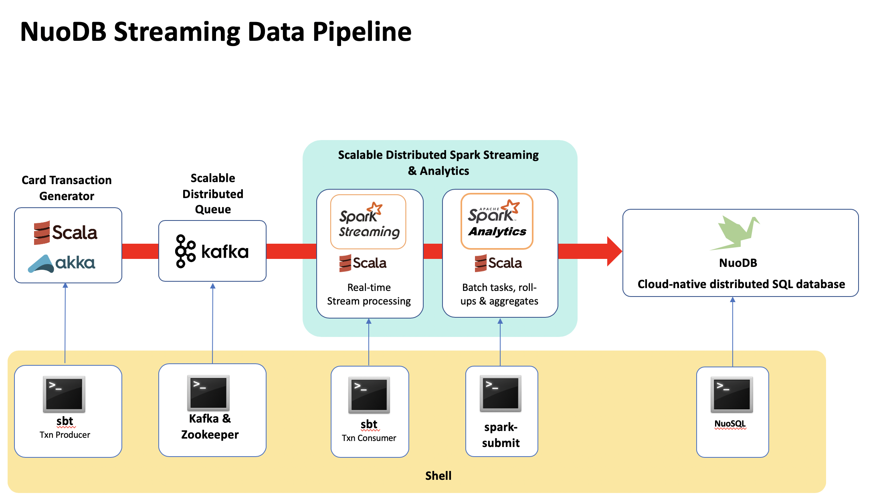

# NuoDB Real-time Card Fraud Analysis Platform

How to use modern, real-time, distributed SQL and streaming technologies to build a working model of a scalable fraud-detection platform. This demo will use these technologies:

- NuoDB
- Spark
- Scala
- Akka
- Solr
- Banana
- Zeppelin

<p>
<p align="center">
  
</p>


## Use Case 
A large bank wants to monitor its customers creditcard transactions to detect and deter fraud attempts. They want the ability to search and group transactions by credit card, period, merchant, credit card provider, amounts, status etc.

The client wants a REST API to return:  

- Identify all transactions tagged as fraudulent in the last minute/day/month/year.
- Identify all transactions tagged as fraudulent for a specific card.
- Report of transactions for a merchant on a specific day.
- Roll-up report of transactions by card and year.
- Search capability to search the entire transaction database by merchant, cc_no, amounts.
- The ratio of transaction success based on the first 6 digits of their credit card no.     
- The ratio of confirmed transactions against fraudulent transactions in the last minute.
- A moving ratio of approved transactions per minute, per hour.
- A count of approved transactions per minute, per hour.

They also want a graphic visualisation - a dashboard - of the data.

## Performance SLAs:
- The client wants an assurance that the data model can handle 1,000 transactions a second with stable latencies.
- The client currently handles accounts for over 15000 merchants and hopes to grow to 50,000 in a year.


## Pre-Requisites
  * A NuoDB 4.x database to run your queries against.
  * Hardware and software requirements for NuoDB are listed here - http://
  * Installation and Deployment options are described here - http://
  * You can download the NuoDB binaries for various platforms here - https://
* A machine on which to install Kafka, Spark and Zeppelin
  * This could be one of the NuoDB Transaction Engines (TE's), or a separate machine/cloud instance, or even a laptop
  * Ideally these services should be in close proximity to the data source in order to reduce latency

This demo uses an installation running on AWS

### URLs
After NuoDB has been installed and configured:
- xxx: http://[NuoDB_NODE_I]:...
- insights: http://[NuoDB_NODE_I]:...

After Spark and Kafka have been installed your URLs will be
- Spark Master: http://[NuoDB_NODE_I]:7080/ e.g. ```http://localhost:7080/```

When the Node.js ReST service has been created:
- Node.js ReST: http://[NuoDB_NODE_IP]:3000 e.g. ```http://localhost:3000``` 

When the dashboard has been configured:
- Visual dashboard: http://[NuoDB_NODE_IP]:8983/banana/#/dashboard e.g. ```http://localhost:8983/banana/#/dashboard```

(where [NuoDB_NODE_IP] is the public IP address of your single node test NuoDB installation)


<h2>Clone the RTFAP2 repository</h2>

Finally, clone this repo to a directory on the machine where you installed NuoDB:
```
$ git clone https://github.com/simonambridge/RTFAP2
```

<h2>Data Model</h2>

To create this schema and the tables described below, run the create schema script:
```
nuosql <node name or IP>
SQL> source 'creates_and_inserts.SQL'
```
This creates the following tables:

- Table Transactions - main transactions table
We will create a Solr index on transactions to support a variety of ReST API queries.

- Table hourlyaggregates_bycc - hourly roll-up of transactions by credit card

- Table dailyaggregates_bycc - daily roll-up of transactions by credit card

- Table monthlyaggregates_bycc - monthly roll-up of transactions by credit card

- Table yearlyaggregates_bycc - yearly roll-up of transactions by credit card

- Table dailytxns_bymerchant - daily roll-up of transactions by merchant

- Table txn_count_min - track transactions in a rolling window for analytics

The create script also creates some sample data for example:

```
INSERT INTO transactions (year, month, day, hour, min, txn_time, cc_no, amount, cc_provider, location, merchant, notes, status, txn_id, user_id, tag)
VALUES ( 2016, 03, 17, 21, 04, '2016-03-17 21:04:19', '1234123412341234', 200.0, 'VISA','San Francisco', 'Nordstrom', 'asked for discounts', 'Approved', '763629', 'tomdavis', 'Fraudulent');
INSERT INTO transaction_items(txn_id,amount, descr) 
VALUES ('763629', 125, 'Trousers'),
       ('763629', 50, 'Dress-shirt'),
       ('763629', 25, 'T-shirt');
```

## Simple queries

We can now run SQL queries to look up all transactions for a given credit card (`cc_no`). 
The Transactions table is primarily write-oriented - it's the destination table for the streamed transactions and used for searches and we don't update the transactions once they have been written.

The table has a primary key so a typical query would look like this:
```
SQL> SELECT * FROM transactions WHERE cc_no='1234123412341234' and year=2016 and month=3 and day=9;

 TXN_ID       CC_NO       YEAR  MONTH  DAY       TXN_TIME       AMOUNT  CC_PROVIDER  COUNTRY  DATE_TEXT  HOUR  LOCATION  MERCHANT  MIN         NOTES          STATUS     TAG     USER_ID
 ------- ---------------- ----- ------ ---- ------------------- ------- ------------ -------- ---------- ----- --------- --------- ---- -------------------- -------- ---------- --------

 098765  1234123412341234 2016    3     9   2016-03-09 11:04:19   200       VISA      <null>    <null>    11    London   Ted Baker  4   pretty good clothing Approved Suspicious tomdavis
```
The roll-up tables can also be queried - for example transactions for each merchant by day use the dailytxns_bymerchant table.

The roll-up tables are empty at this point - they get populated using the Spark batch and streaming analytics jobs that we run later.


### Searching with SQL

Structured Query Language (SQL) allows you to search for data in the database tables that were created above.

For example, get all transactions for a specified card number on a specified day.
```
SQL> select t.txn_id, t.cc_no, t.merchant,ti.amount, ti.descr from transactions t inner join transaction_items ti on t.txn_id=ti.txn_id WHERE t.cc_no='1234123412341234' and t.txn_id=ti.txn_id order by t.txn_id;

 TXN_ID       CC_NO       MERCHANT  AMOUNT     DESCR
 ------- ---------------- --------- ------- -----------

 098765  1234123412341234 Ted Baker   125   Clothes
 098765  1234123412341234 Ted Baker   55    Shoes
 098765  1234123412341234 Ted Baker   25    Fragrance
 763629  1234123412341234 Nordstrom   125   Trousers
 763629  1234123412341234 Nordstrom   50    Dress-shirt
 763629  1234123412341234 Nordstrom   25    T-shirt
```

Get transactions by first 6 digits of cc_no and status.
```
SQL> SELECT * FROM transactions where cc_no like '123412%' and status='Rejected';;

 TXN_ID       CC_NO       YEAR  MONTH  DAY       TXN_TIME       AMOUNT  CC_PROVIDER  COUNTRY  DATE_TEXT  HOUR    LOCATION    MERCHANT  MIN         NOTES         STATUS     TAG     USER_ID
 ------- ---------------- ----- ------ ---- ------------------- ------- ------------ -------- ---------- ----- ------------- --------- ---- ------------------- -------- ---------- --------

 763629  1234123412341234 2016    3     17  2016-03-17 21:04:19   200       VISA      <null>    <null>    21   San Francisco Nordstrom  4   asked for discounts Rejected Fraudulent tomdavis
```

When we start generating some live data we'll be able to analyse up-to-date information.

These samples demonstrate that full, ad-hoc search on any of the transaction fields is possible including amounts, merchants etc.

Queries like this will be used to build the ReST interface. 

You can use SQLsh to explore the list of provided ReST queries here: http://github.com/simonambridge/RTFAP2/tree/master/SQL_Queries.md 

## Querying Data Using A ReST API with Node.js and D3

The sample queries are served by a web service written in Node.js. The code for this web service is provided in the repo.
ReST Web Interface

A ReSTful web interface provides an API for calling programs to query the data in NuoDB.

Use a web browser to run the queries. Use the example url’s supplied - these will return a json representation of the data using the ReST service. Alternatively paste the queries into nuosql and run them from the SQL command line.

The instructions for setting up the ReST Server are described here: http://github.com/simonambridge/RTFAP2/tree/master/ReST.md

The next section moves on to batch and streaming analytics with Spark!

## Analyzing data using NuoDB Spark Analytics

NuoDB provides integration with Spark out-of-the box to enable analysis of data in-place on the same cluster where the data is ingested and stored. Workloads can be isolated and there is no need to ETL the data. The data ingested in a NuoDB-only (OLTP) data center can be automatically replicated to a logical data center of NuoDB nodes also hosting Spark Workers.

This tight integration between NuoDB and Spark offers huge value in terms of significantly reduced ETL complexity (no data movement to different clusters) and thus reducing time to insight from your data through a much less complex "cohesive lambda architecture" .

### Streaming Analytics

The streaming analytics element of this application is made up of two parts:

* A transaction "producer" - a Scala/Akka app that generates random credit card transactions and then places those transactions onto a Kafka queue. 
* A transaction "consumer" - also written in Scala, is a Spark streaming job that (a) consumes the messages put on the Kafka queue, and then (b) parses those messages, evalutes the transaction status and then writes them to the Datastax/NuoDB table `transactions`. It also generates rolling summary lines into the `txn_count_min` table every minute.

Streaming analytics code can be found under the directory `TransactionHandlers/producer` (pre-requisite: make sure you have run the SQL schema create script as described above to create the necessary tables).

Follow the Spark streaming installation and set up instructions here: https://github.com/simonambridge/RTFAP2/tree/master/TransactionHandlers/README.md

### Batch Analytics

Two Spark batch jobs have been included. 
* `run_rollupbymerchant.sh` provides a daily roll-up of all the transactions in the last day, by merchant. 
* `run_rollupbycc.sh` populates the hourly/daily/monthly/yearly aggregate tables by credit card, calculating the total_amount, avg_amount and total_count.

The roll up batch analytics code and submit scripts can be found under the directory `RollUpReports` (pre-requisite: run the streaming analytics first in order to populate the Transaction table with transactions).

Follow the Spark batch job installation and set up instructions here:https://github.com/simonambridge/RTFAP2/tree/master/RollUpReports/README.md

At this point the system should be setup and functioning. Now you'll want to know what the capabilities of this platform are so that you can begin to understand what kind of hardware you might need to build a real system. We can use the NuoDB Stress Tool to help us measure.

## Stress yaml 

Running a NuoDB-stress test with the appropriate YAML profile for the table helps show how NuoDB will perform in terms of latency and throughput for writes and reads to/from the system.

You can read more about using stress yamls to stress test a data model  [here](http://www.datastax.com/dev/blog/improved-NuoDB-2-1-stress-tool-benchmark-any-schema) and [here](http://docs.datastax.com/en/NuoDB/2.1/NuoDB/tools/toolsCStress_t.html).

The stress YAML files are in the [stress_yamls directory](https://github.com/simonambridge/RTFAP2/tree/master/stress_yamls).

The stress tool will inject synthetic data so we will use a different table specifically for the stress testing.

When you originally ran the ```creates_and_inserts.SQL``` script to create the transaction and rollup tables you also created the dummy table ```txn_by_cc``` that will be used by NuoDB-stress.

The YAML tries to mirror real data, for example: month is a value between 1 and 12, year is between 2010 and 2016, credit card number is 16 characters in length, etc. The text fields are filled with unreadable gibberish :)

NuoDB-stress generates a lot of output as it repeatedly runs the write test (10,000 records) while increasing the number of threads. This allows you to view the optimum number of threads required to run the task.

An example of running the stress tool is shown below using [txn_by_cc_stress.yaml](https://github.com/simonambridge/RTFAP2/blob/master/stress_yamls/txn_by_cc_stress.yaml):

For inserts
```
NuoDB-stress user profile=./txn_by_cc_stress.yaml ops\(insert=1\) cl=LOCAL_ONE n=100000 -rate auto -node 127.0.0.1
******************** Stress Settings ********************
Command:
  Type: user
  Count: 100,000
  No Warmup: false
  Consistency Level: LOCAL_ONE
  Target Uncertainty: not applicable
  Command Ratios: {insert=1.0}
  Command Clustering Distribution: clustering=gaussian(1..10)
  Profile File: ./txn_by_cc_stress.yaml
```
...
```
Connected to cluster: Test Cluster, max pending requests per connection 128, max connections per host 8
Datatacenter: SearchGraphAnalytics; Host: /127.0.0.1; Rack: rack1
Generating batches with [1..1] partitions and [0..100] rows (of [1..1] total rows in the partitions)

Sleeping 2s...
Warming up insert with 25000 iterations...
Thread count was not specified

Running with 4 threadCount
Running [insert] with 4 threads for 100000 iteration
type       total ops,    op/s,    pk/s,   row/s,    mean,     med,     .95,     .99,    .999,     max,   time,   stderr, errors,  gc: #,  max ms,  sum ms,  sdv ms,      mb
total,          1957,    1957,    1957,    1957,     0.6,     0.6,     1.0,     1.4,     4.1,     4.2,    1.0,  0.00000,      0,      0,       0,       0,       0,       0
total,          9200,    7243,    7243,    7243,     0.5,     0.5,     0.9,     1.4,     3.9,     8.5,    2.0,  0.40729,      0,      0,       0,       0,       0,       0
total,         17843,    8643,    8643,    8643,     0.4,     0.4,     0.7,     1.0,     3.6,    12.9,    3.0,  0.28055,      0,      0,       0,       0,       0,       0
total,         29181,   11338,   11338,   11338,     0.3,     0.3,     0.5,     0.6,     1.6,     4.1,    4.0,  0.23372,      0,      0,       0,       0,       0,       0
total,         40477,   11296,   11296,   11296,     0.3,     0.3,     0.5,     0.7,     1.9,     9.5,    5.0,  0.19039,      0,      0,       0,       0,       0,       0
total,         52611,   12134,   12134,   12134,     0.3,     0.3,     0.4,     0.4,     0.6,     4.0,    6.0,  0.16215,      0,      0,       0,       0,       0,       0
total,         64166,   11555,   11555,   11555,     0.3,     0.3,     0.4,     0.5,     1.1,    29.1,    7.0,  0.13946,      0,      0,       0,       0,       0,       0
total,         73958,    9792,    9792,    9792,     0.3,     0.3,     0.4,     0.4,     0.7,     4.1,    8.0,  0.12132,      0,      1,     285,     285,       0,    2037
total,         84188,   10230,   10230,   10230,     0.5,     0.3,     0.5,     0.6,     1.1,   286.8,    9.0,  0.11473,      0,      0,       0,       0,       0,       0
total,         95703,   11515,   11515,   11515,     0.3,     0.3,     0.4,     0.6,     1.1,     4.4,   10.0,  0.10276,      0,      0,       0,       0,       0,       0
total,        100000,   11688,   11688,   11688,     0.3,     0.3,     0.4,     0.5,     1.0,     3.9,   10.4,  0.09315,      0,      0,       0,       0,       0,       0


Results:
Op rate                   :    9,645 op/s  [insert: 9,645 op/s]
Partition rate            :    9,645 pk/s  [insert: 9,645 pk/s]
Row rate                  :    9,645 row/s [insert: 9,645 row/s]
Latency mean              :    0.4 ms [insert: 0.4 ms]
Latency median            :    0.3 ms [insert: 0.3 ms]
Latency 95th percentile   :    0.6 ms [insert: 0.6 ms]
Latency 99th percentile   :    0.8 ms [insert: 0.8 ms]
Latency 99.9th percentile :    2.5 ms [insert: 2.5 ms]
Latency max               :  286.8 ms [insert: 286.8 ms]
Total partitions          :    100,000 [insert: 100,000]
Total errors              :          0 [insert: 0]
Total GC count            : 1
Total GC memory           : 1.989 GiB
Total GC time             :    0.3 seconds
Avg GC time               :  285.0 ms
StdDev GC time            :    0.0 ms
Total operation time      : 00:00:10

Sleeping for 15s
```
    
You should see an improvement in op rate performance as the thread count increases:

```
Running with 8 threadCount
Running [insert] with 8 threads for 100000 iteration
type       total ops,    op/s,    pk/s,   row/s,    mean,     med,     .95,     .99,    .999,     max,   time,   stderr, errors,  gc: #,  max ms,  sum ms,  sdv ms,      mb
total,          8754,    8754,    8754,    8754,     0.5,     0.4,     1.2,     2.5,     8.7,    18.9,    1.0,  0.00000,      0,      0,       0,       0,       0,       0
total,         24726,   15972,   15972,   15972,     0.5,     0.4,     1.1,     2.3,     4.8,    10.1,    2.0,  0.20353,      0,      0,       0,       0,       0,       0
total,         40459,   15733,   15733,   15733,     0.5,     0.4,     1.1,     2.2,     5.8,    32.4,    3.0,  0.14378,      0,      0,       0,       0,       0,       0
total,         56556,   16097,   16097,   16097,     0.5,     0.4,     1.1,     2.0,     4.4,     7.3,    4.0,  0.10961,      0,      0,       0,       0,       0,       0
total,         70403,   13847,   13847,   13847,     0.6,     0.4,     1.0,     1.9,     5.1,   140.8,    5.0,  0.08817,      0,      1,     138,     138,       0,    1961
total,         86375,   15972,   15972,   15972,     0.5,     0.4,     1.0,     1.9,     4.9,    11.2,    6.0,  0.07374,      0,      0,       0,       0,       0,       0
total,        100000,   15652,   15652,   15652,     0.5,     0.4,     1.0,     2.1,     6.0,    20.3,    6.9,  0.06326,      0,      0,       0,       0,       0,       0


Results:
Op rate                   :   14,555 op/s  [insert: 14,555 op/s]
Partition rate            :   14,555 pk/s  [insert: 14,555 pk/s]
Row rate                  :   14,555 row/s [insert: 14,555 row/s]
Latency mean              :    0.5 ms [insert: 0.5 ms]
Latency median            :    0.4 ms [insert: 0.4 ms]
Latency 95th percentile   :    1.1 ms [insert: 1.1 ms]
Latency 99th percentile   :    2.1 ms [insert: 2.1 ms]
Latency 99.9th percentile :    5.6 ms [insert: 5.6 ms]
Latency max               :  140.8 ms [insert: 140.8 ms]
Total partitions          :    100,000 [insert: 100,000]
Total errors              :          0 [insert: 0]
Total GC count            : 1
Total GC memory           : 1.915 GiB
Total GC time             :    0.1 seconds
Avg GC time               :  138.0 ms
StdDev GC time            :    0.0 ms
Total operation time      : 00:00:06

Improvement over 4 threadCount: 51%
Sleeping for 15s
```

You can specify a fixed number of threads for a specific test, using multiple nodes:
```
NuoDB-stress user profile=./txn_by_cc_stress.yaml ops\(insert=1\) cl=LOCAL_ONE n=100000 -rate threads=8 -node 10.0.0.4,10.0.0.5,10.0.0.7
```

For reads
```
NuoDB-stress user profile=./txn_by_cc_stress.yaml ops\(singletrans=1\) -node 127.0.0.1

NuoDB-stress user profile=./txn_by_cc_stress.yaml ops\(dailytrans=1\) -node 127.0.0.1

```
Examples are provided for [read](https://github.com/simonambridge/RTFAP2/blob/master/stress_yamls/stress-read.log) and [write](https://github.com/simonambridge/RTFAP2/blob/master/stress_yamls/stress-write.log) stress tests from my Mac Pro.

## Visual Dashboard - Lucidworks Banana

The Banana project was forked from Kibana, and works with all kinds of time series (and non-time series) data stored in Apache Solr. It uses Kibana's powerful dashboard configuration capabilities, ports key panels to work with Solr, and provides significant additional capabilities, including new panels that leverage D3.js.

Banana allows you to create rich and flexible UIs, enabling users to rapidly develop end-to-end applications that leverage the power of Apache Solr.

Follow this [guide](https://github.com/simonambridge/RTFAP2/tree/master/banana/Banana_Setup.md) to set it up.

The dashboard below was created using Banana.


<sub>Acknowldegements: Based on the original RTFAP created with help from colleagues at DataStax.
<BR>RTFAP2 now has a Node.js/D3 ReST interface replacing Java, enhanced producer/consumer codebase, new roll-up reports, real time charts, a new demo ReST UI, improved documentation, etc</sub>
