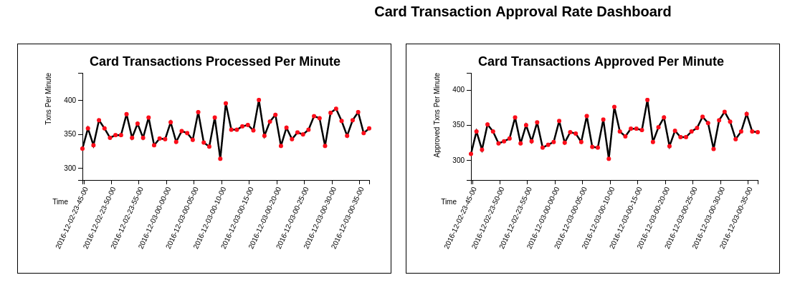

# NuoDB Card Fraud Prevention Demo - Streaming Analytics

## Creating and Consuming Transactions

Based on an original creation by Cary Bourgeois. 

This project consists of two elements:
   
* Transaction Producer
* Transaction Consumer

The transaction producer is a Scala application that leverages the Akka framework (lightly) to generate pseudo-random credit card transactions, and then place those transactions on a Kafka queue. There is some fairly trivial yet fun logic for spreading the transactions proportionally across the top 100 retailers in the world based on total sales. It does a similar thing for the countries of the world based on population.

The Transaction consumer, also written in Scala, is a Spark streaming job. This job performs two main tasks. 
- First, it consumes the messages put on the Kafka queue.
  - It then parses those messages, evalutes the data and flags each transaction as "APPROVED" or "REJECTED". This is the place in the job where more application specific (or complex) logic should be placed. In a real world application this could be a scoring that could decide whether a transaction should be accepted or rejected. You would also want to implement things like black-list lookups and other validation or analysis. 
  - Finally, once evaluated, the records are then written to the NuoDB ```transactions``` table.

- The second part of the Spark consumer job counts the number of records processed each minute, and stores that data to an aggregates table. The only unique aspect of this flow is that the job also reads back from from this table and builds a rolling count of the data. 

<p align="left">
  
</p>

## Demo Set Up

### Pre-requisites
The following components must be installed and available on your machine.

NB this demo is built using Spark Direct Streams (Kafka in this demo) 

  1. NuoDB v4.0.x
  2. Apache Kafka 2.4.0, I used the Scala 2.11 build
  3. Apache Spark 2.4.4
  4. Akka 2.6.1
  5. sbt (Scala Build Tool) 1.3.5
  6. An internet connection, required to download dependencies


## 2. Installing and Using Apache Kafka

https://github.com/simonambridge/NCFP/blob/master/TransactionHandlers/NCFP-Kafka-Install.md

## 3. Installing and Using Apache Spark

https://github.com/simonambridge/NCFP/blob/master/TransactionHandlers/NCFP-Spark-Install.md

## 4. Install SBT (Scala Build Tool) and build the demo

If you havent done it already, install sbt (as root or use sudo). You will need sbt to compile the streaming and batch services written in Scala.

On Centos/RHEL (check latest release at https://www.scala-sbt.org/download.html):
```
$ wget http://dl.bintray.com/sbt/rpm/sbt-1.3.5.rpm
```
Install the rpm:
```
$ rpm -qa sbt-1.3.5.rpm
```

Run sbt update to download the libraries and dependencies (may take a little while):
```
$ sbt update
```

When you first compile with sbt it may take some time to download the libraries and packages required.


### Build the packages

* You should have already created the NuoDB tables using the creates_and_inserts.cql script
* All components should be working e.g. Zookeeper, Kafka

> If you are restarting the demo you can clear the tables using the clear_tables.cql script

1. Navigate to the project TransactionHandlers directory:

    ```
    $ cd <path>/NuoDB-Card-Fraud-Prevention/TransactionHandlers
    ```
    
    Update sbt (may take a little while):

    ```
    $ sbt update
    [info] Done updating.
    [success] Total time: 8 s, completed 20-Dec-2019 01:19:04

    ```
    
    
    Clean up the build environment:

    ```
    $ sbt clean
    [info] Set current project to transactionhandlers (in build file:/Users/sambridge/Documents/Projects/GitHub/NuoDB-Card-Fraud-Prevention/TransactionHandlers/)
    [success] Total time: 0 s, completed 20-Dec-2019 01:20:23
    ```


2. Build the Producer app with this command:
  
    ```$ sbt producer/package```
    
    Make sure the build is successful:
    ```
    [info] Done packaging.
    [success] Total time: 5 s, completed 30-Dec-2019 15:31:16
    ```

    > If there are any errors reported, you must resolve them before continuing.


3. Build the Consumer app with this command:
  
    ```
    $ sbt consumer/package
    ```
    
    Make sure the build is successful:
    ```
    [info] Done packaging.
    [success] Total time: 14 s, completed 30-Dec-2019 15:34:42
    ```
    > If there are any errors reported, you must resolve them before continuing.
    

## Run the demo

  At this point the code has compiled successfully.

  The next step is to start the producer and consumer to start generating and receiving transactions.


### Start the Transaction Producer app

From the root directory of the project (`<NCFP install path>/NCFP/TransactionHandlers`) start the producer app:
  
Navigate to the TransactionHandlers directory
```
$ cd /<NCFP install path>/NCFP/TransactionHandlers
```

Start the producer app:
```
$ sbt producer/run
```

After some initial output you will see card transactions being created and posted to Kafka:
```
[info] Set current project to transactionhandlers (in build file:/u02/dev/dse_dev/RTFAP/RTFAP2/TransactionHandlers/)
[info] Running TransactionProducer 
kafkaHost 127.0.0.1:9092
kafkaTopic NewTransactions
maxNumTransPerWait 5
waitMillis 500
runDurationSeconds -1
[DEBUG] [11/09/2017 22:31:09.061] [run-main-0] [EventStream(akka://TransactionProducer)] logger log1-Logging$DefaultLogger started
[DEBUG] [11/09/2017 22:31:09.063] [run-main-0] [EventStream(akka://TransactionProducer)] Default Loggers started
...
(cc_no=,2251000088321444, txn_time=,2017-11-09 22:31:09.735, items=,Item_28750->128.66, amount=,128.66)
(cc_no=,9065000095025035, txn_time=,2017-11-09 22:31:09.735, items=,Item_94332->246.57,Item_16778->708.27,Item_89204->541.07, amount=,1495.91)
(cc_no=,2195000009045559, txn_time=,2017-11-09 22:31:09.735, items=,Item_92502->194.22, amount=,194.22)
196 Transactions created.
(cc_no=,3531000024839480, txn_time=,2017-11-09 22:31:10.237, items=,Item_88890->564.97,Item_99369->404.01,Item_38980->827.30, amount=,1796.28)
(cc_no=,7017000098496305, txn_time=,2017-11-09 22:31:10.238, items=,Item_45228->447.20, amount=,447.20)
(cc_no=,8139000079813195, txn_time=,2017-11-09 22:31:10.238, items=,Item_56710->746.63,Item_76484->793.98, amount=,1540.61)
201 Transactions created.
...
```

Leave this job running to continue to generate transactions.

The records for each transaction are consumed and stored in a NuoDB table.
You can view the records that are being created. Start NuoSQL and run the following query:
```
SQL> select * from transactions;

cc_no            | year | month | day | txn_time                        | amount  | cc_provider | country | date_text | hour | items | location | merchant                  | min | notes | solr_query | status   | tags | txn_id                               | user_id
------------------+------+-------+-----+---------------------------------+---------+-------------+---------+-----------+------+-------+----------+---------------------------+-----+-------+------------+----------+------+--------------------------------------+---------
 1640000007096559 | 2017 |    11 |   5 | 2017-12-05 21:19:24.096000+0000 | 1044.02 |        1640 |      CN |  20171105 |    9 |  null |          |           AVB Brandsource |  19 |  null |       null | APPROVED | null | e96da250-0c58-4d9e-9765-b331c6d6fcc2 |    null
 1847000039868834 | 2017 |    11 |   5 | 2017-12-05 21:20:20.365000+0000 | 1535.59 |        1847 |      NG |  20171105 |    9 |  null |          |           Wal-Mart Stores |  20 |  null |       null | REJECTED | null | cd9c157c-56ff-4799-9511-37a680f7e817 |    null
```
The number of records will constantly increase - re-run this command in cqlsh a few times:
```
SQL> select count (*) from rtfap.transactions ;

 count
-------
  3832

(1 rows)
```


### Start the Transaction Consumer app
 
  1. Start the consumer app.
  
  Navigate to the TransactionHandlers directory
  ```
  $ cd /<RTFAP2 install path>/RTFAP2/TransactionHandlers
  ```
  
  > You no longer need to specify a spark master address in the dse spark-submit command:
  
  Use the dse command to submit a spark job:
  ```
  $ spark-submit --jars /Users/simonambridge/.ivy2/cache/com.typesafe/config/bundles/config-1.3.2.jar --packages org.apache.spark:spark-streaming-kafka_2.11:1.6.3 --class TransactionConsumer consumer/target/scala-2.11/consumer_2.11-0.1.jar
  ```

  After some initial output you will see records being consumed from Kafka by Spark:
  
  ```
  Ivy Default Cache set to: /home/dse/.ivy2/cache
  The jars for the packages stored in: /home/dse/.ivy2/jars
  :: loading settings :: url = jar:file:/usr/share/dse/spark/lib/ivy-2.4.0.jar!/org/apache/ivy/core/settings/ivysettings.xml
  org.apache.spark#spark-streaming-kafka_2.10 added as a dependency
  :: resolving dependencies :: org.apache.spark#spark-submit-parent;1.0
  ...
  6 rows processed...
  +----------------+-----------+----+-----+---+----+---+--------------------+--------------------+----------------+--------+-------+-------+--------+---------+
  |           cc_no|cc_provider|year|month|day|hour|min|            txn_time|              txn_id|        merchant|location|country| amount|  status|date_text|
  +----------------+-----------+----+-----+---+----+---+--------------------+--------------------+----------------+--------+-------+-------+--------+---------+
  |1567000016674783|       1567|2016|   11|  3|   0| 37|2016-12-03 00:37:...|e4425655-348c-47d...|Lowe's Companies|        |     KH|1153.26|APPROVED| 20161103|
  |8797000077172306|       8797|2016|   11|  3|   0| 37|2016-12-03 00:37:...|abeae2c2-173c-429...|       SUPERVALU|        |     DE| 812.28|APPROVED| 20161103|
  |5034000081986740|       5034|2016|   11|  3|   0| 37|2016-12-03 00:37:...|afa129ee-6829-4b0...|  Dollar General|        |     IN|1324.22|REJECTED| 20161103|
  |5859000021039989|       5859|2016|   11|  3|   0| 37|2016-12-03 00:37:...|ef372bb1-dedf-421...|          Costco|        |     ID| 757.88|APPROVED| 20161103|
  +----------------+-----------+----+-----+---+----+---+--------------------+--------------------+----------------+--------+-------+-------+--------+---------+

  4 rows processed...
  +----------------+-----------+----+-----+---+----+---+--------------------+--------------------+---------------+--------+-------+-------+--------+---------+
  |           cc_no|cc_provider|year|month|day|hour|min|            txn_time|              txn_id|       merchant|location|country| amount|  status|date_text|
 +----------------+-----------+----+-----+---+----+---+--------------------+--------------------+---------------+--------+-------+-------+--------+---------+
  |5907000019173296|       5907|2016|   11|  3|   0| 37|2016-12-03 00:37:...|93c3741b-5132-49e...|     DineEquity|        |     EG| 896.46|APPROVED| 20161103|
  |7624000055927622|       7624|2016|   11|  3|   0| 37|2016-12-03 00:37:...|e7a09e38-543b-4bf...|     Albertsons|        |     FR|1944.73|APPROVED| 20161103|
  |5539000022858144|       5539|2016|   11|  3|   0| 37|2016-12-03 00:37:...|a2aefc67-c97c-48e...|Jack in the Box|        |     CN|2491.93|APPROVED| 20161103|
  +----------------+-----------+----+-----+---+----+---+--------------------+--------------------+---------------+--------+-------+-------+--------+---------+
  ```

  Leave this job running to continue to process transactions.

  2. At this point you can use NuoSQL to check the number of rows in the Transactions table - you should see that there are records appearing as they are posted by the consumer process:

  ```
  SQL> select count(*) from transactions;

 COUNT
 ------

  1962
  
  SQL> select * from transactions limit 10;

                TXN_ID                     CC_NO       YEAR  MONTH  DAY         TXN_TIME         AMOUNT  CC_PROVIDER  COUNTRY  DATE_TEXT  HOUR    LOCATION       MERCHANT     MIN            NOTES             STATUS     TAG        USER_ID
 ------------------------------------ ---------------- ----- ------ ---- ----------------------- ------- ------------ -------- ---------- ----- ------------- --------------- ---- -------------------------- -------- ---------- -------------

 62d1be5d-15f3-4d04-88ad-a937a3b49e95 1234123412341234 2020    1     2   2020-01-02 11:04:19     200      VISA         <null>   <null>     11   London        Ted Baker         4  pretty good clothing       Approved Suspicious tomdavis
 63d1be5d-15f3-4d04-88ad-a937a3b49e95 1234123412341235 2020    1     2   2020-01-02 11:04:24     400      VISA         <null>   <null>     11   Manchester    Macy              4  cool stuff-good customer   Approved HighValue  simonanbridge
 64d1be5d-15f3-4d04-88ad-a937a3b49e95 1234123412341235 2020    1     2   2020-01-02 11:04:53     800      VISA         <null>   <null>     11   London        Harrods           4  customer likes electronics Approved HighValue  simonanbridge
 65d1be5d-15f3-4d04-88ad-a937a3b49e95 1234123412341236 2020    1     3   2020-01-03 11:04:59     750      MASTERCARD   <null>   <null>     11   San Jose      GAP               4  customer likes electronics Approved HighValue  mikestewart
 66d1be5d-15f3-4d04-88ad-a937a3b49e95 1234123412341237 2020    1     3   2020-01-03 12:30:00     1500     AMEX         <null>   <null>     12   New York      Ann Taylor       30  frequent customer          Approved HighValue  caroline
 67d1be5d-15f3-4d04-88ad-a937a3b49e95 1234123412341234 2020    1     3   2020-01-04 21:04:19     200      VISA         <null>   <null>     21   San Francisco Nordstrom         4  asked for discounts        Approved Fraudulent tomdavis
 047b4338-f298-4641-b616-a091086ef758 4130000045996385 2020    0     7   2020-01-07 19:49:14.168 2686.52  4130         CN       20200007    7                 H-E-B Grocery    49  <null>                     APPROVED <null>     <null>
 4c4e3859-c92e-4f0e-8759-617b1d081179 1474000013828218 2020    0     7   2020-01-07 19:49:14.169 786.38   1474         IN       20200007    7                 Starbucks        49  <null>                     APPROVED <null>     <null>
 73ba658b-b810-4dd1-8976-0b1064212c06 5552000004197795 2020    0     7   2020-01-07 19:49:14.169 1426.29  5552         GH       20200007    7                 CVS Caremark     49  <null>                     APPROVED <null>     <null>
 fcaf0c8a-6082-43b4-bc46-eca8378409fc 5391000063419149 2020    0     7   2020-01-07 19:49:14.17  1862.27  5391         CN       20200007    7                 Wal-Mart Stores  49  <null>                     APPROVED <null>     <null>

  ```

  3. Every 60 seconds you will also see the consumer process generate output similar to the following:
```
  Time=Sat Dec 03 00:37:44 GMT 2016
  +----+-----+---+----+------+-------------------+-----------------+-----------+----------------+-----------------+----------+---------------+
  |year|month|day|hour|minute|               time|approved_rate_min|ttl_txn_min|approved_txn_min| approved_rate_hr|ttl_txn_hr|approved_txn_hr|
  +----+-----+---+----+------+-------------------+-----------------+-----------+----------------+-----------------+----------+---------------+
  |2016|   12|  3|   0|    37|2016-12-03 00:37:44|94.55958549222798|        386|             365|95.27943966146213|     13706|          13059|
  +----+-----+---+----+------+-------------------+-----------------+-----------+----------------+-----------------+----------+---------------+
  ```

  This is real-time analysis of the approved vs. rejected transactions rate and percentage. 
  
  These records are stored in the ```txn_count_min``` table, for example:
  
  ```
 SQL> SELECT * FROM txn_count_min;

 YEAR  MONTH  DAY  HOUR  MINUTE         TIME         APPROVED_RATE_HR  APPROVED_RATE_MIN  APPROVED_TXN_HR  APPROVED_TXN_MIN  TTL_TXN_HR  TTL_TXN_MIN
 ----- ------ ---- ----- ------- ------------------- ----------------- ------------------ ---------------- ----------------- ----------- ------------

 2020    1     7    19     50    2020-01-07 19:50:14 94.87179487179486 94.87179487179486         333              333            351         351
 2020    1     7    19     51    2020-01-07 19:51:14 95.70200573065902 96.54178674351584         668              335            698         347
 2020    1     7    19     52    2020-01-07 19:52:14 95.635305528613   95.4954954954955          986              318           1031         333
 2020    1     7    19     53    2020-01-07 19:53:14 94.92857142857143 92.95392953929539        1329              343           1400         369
 2020    1     7    20     35    2020-01-07 20:35:51 96                96                         96               96            100         10000:03:44+0000 |       1414 |         352
  ```


